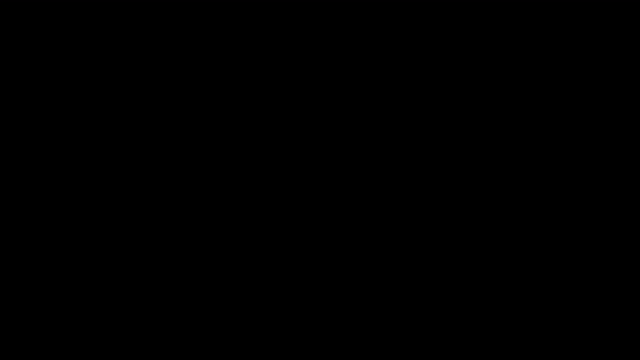

# Another World - Hebrew Translation Project

This is a fan project to translate the game "Another World" (Out of This World, Outer World) into Hebrew.

### How does it look? 👀




### Introduction 🎁

Another World means a lot to many people. Gamers, myself included, have been obsessed with this game since it
was released in the early 90s. Ask any fan, and you'll hear stories about the exhilaration of jumping off a cliff
while hanging by a rope or the thrill of kicking a guard in the groin and running for the gun. These memorable
moments have left a lasting impact on all of us.

### Technical Details 🤓

Throughout the game there are only a few strings. All of them are stored within the main executable file, `ANOTHER.EXE`.

There were two ways of translating the game:
1. Patch the executable file, change the strings, add new font.
2. Patch the animation file, render the Hebrew text as part of shapes available in the game.

I chose the second option, because this allows translations to other languages. You are no longer bound by the sizes of the
strings within the .exe. Furthermore, just run the patch on a different version, and it should work just fine. Although some versions have
additional opcodes that are not covered by Another World Swiss Army Knife.

### Hebrew Font אַ

For the Hebrew font, I chose to use the font that I dumped from my Apple IIe computer. It's a 6x8 font, and it looks great in the game. Any
font of any size would work fine.

Here is the entire font from the Apple IIe rom dump:


Alternatively, I could have picked the VGA Hebrew font which would be as symbolic as this one.

### Introduction Files

Introduction for Another World is split into 3 files: a palette file, a code file, and a shapes file.

```text
 2048 resources/0017.pal
 9871 resources/0018.txt
65230 resources/0019.shp
```

So is every level in the game. You can read more about the resources in the game at [Fabien's Another World](https://fabiensanglard.net/another_world_polygons/index.html)
technical document.

### Implementation Details

Adding each letter of the new font into the shapes file and using the code file to render the text seemed logical. However, with only 305 bytes left
within the 64KB limit, I opted for a creative alternative.

Each shape in the shapes file can be rendered with a zoom factor (scale), you can scale down to 1/64 or scale up to x4. I tracked down a simple shape
at offset 45296 that when scaled down to 1/64th, it renders a single pixel.

A small TypeScript program processes a YAML file of required translations and patches the code file to render a sprite for each pixel in the font. For example,
the text "HELLO" would generate up to 6 * (6*8) = 288 calls to the `spr` opcode.

Here is a snippet of the code that draws "Good evening professor." (in Hebrew, of course):

```text
draw_good_evening_professor:			// "Good evening professor."
	spr     45296   291     171     1
	spr     45296   292     171     1
	spr     45296   294     171     1
	spr     45296   295     171     1
	spr     45296   292     172     1
	spr     45296   295     172     1
	spr     45296   293     173     1
	spr     45296   295     173     1
	spr     45296   293     174     1
	spr     45296   295     174     1
	spr     45296   293     175     1
	spr     45296   294     175     1
	spr     45296   291     176     1
	spr     45296   292     176     1
	spr     45296   293     176     1
	spr     45296   284     171     1
	spr     45296   285     171     1
	spr     45296   286     171     1
	spr     45296   287     171     1
```

Each non-transparent pixel in the font yields an `spr` opcode with 1/64 scale. Since this adds many opcodes, the resulting code file is larger:

```text
46904 resources/0018.txt
```

Still below 64kb, so we're good 😎

### Links ⛓️

- Eric Chahi's technical document of Another World's opcodes [link](https://anotherworld.fr/another_world.htm)
- Fabien Sanglard's 8-part technical document of Another World [link](https://fabiensanglard.net/another_world_polygons/index.html)
- Cyx's reverse-engineered Another World on all of its versions [link](https://github.com/cyxx/rawgl)
- Another World on Eric Chahi's website [link](https://anotherworld.fr/another_world.htm)

### License 🖖

This project is licensed under the GPL 3 License - see the [LICENSE.md](LICENSE.md) file for details

### Credits 🫡

Introduction title graphics in Hebrew done by the brilliant Niv Baehr [github](https://github.com/blooperz) 🙏

### Contact


